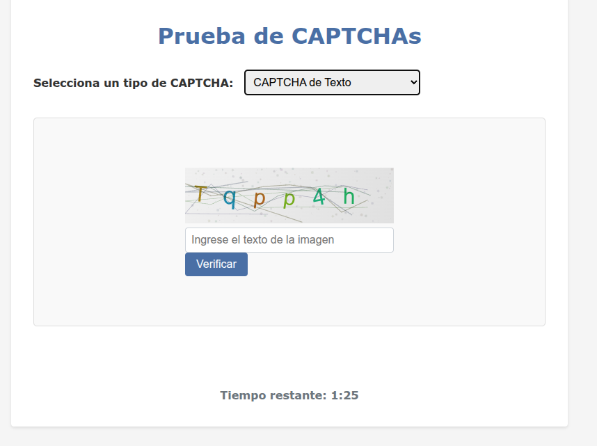
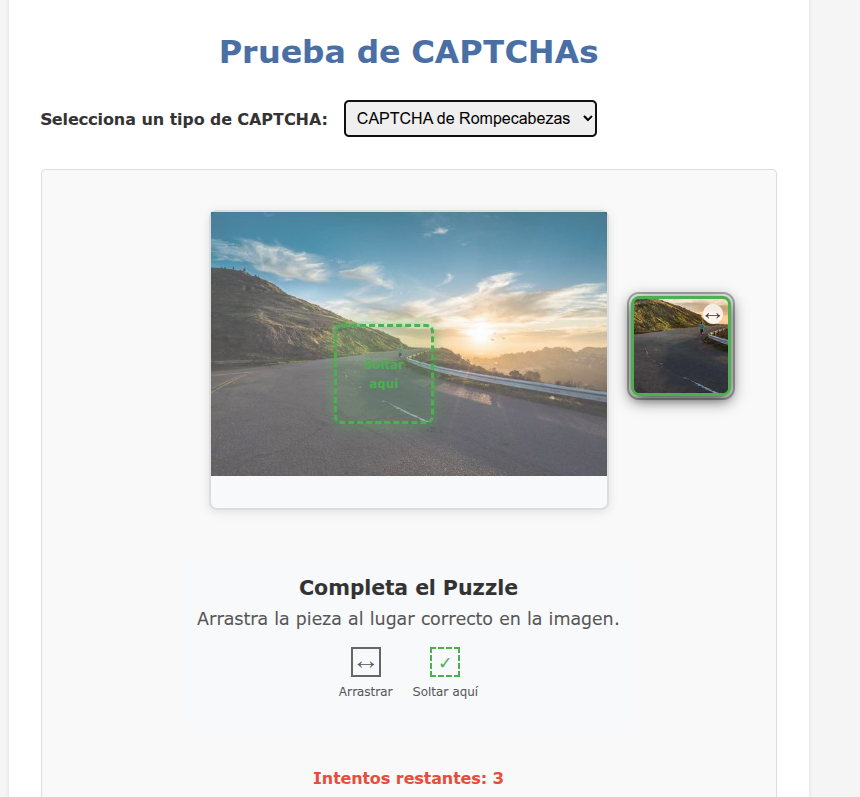
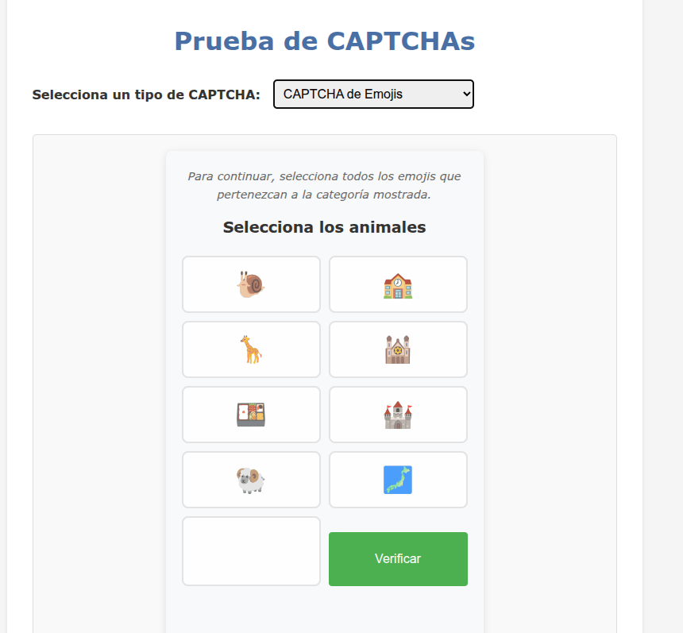
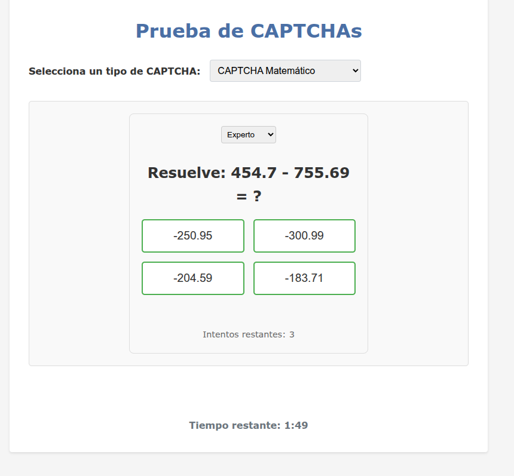

# Sistema de CAPTCHA Avanzado

# Sistema de CAPTCHA Avanzado

Sistema de CAPTCHA modular que implementa múltiples tipos de desafíos de seguridad para la validación de usuarios humanos. El sistema está diseñado para ser fácil de integrar, altamente personalizable y accesible.

## Características Principales

- **Múltiples tipos de CAPTCHA**:
  - Texto
  - Rompecabezas
  - Emojis
  - Matemático con diferentes niveles de dificultad

- **Seguridad mejorada**:
  - Protección contra automatización
  - Tiempo de expiración configurable
  - Límite de intentos

- **Experiencia de usuario**:
  - Interfaz intuitiva
  - Retroalimentación inmediata
  - Accesible

## Tipos de CAPTCHA

### 1. CAPTCHA de Texto


### 2. CAPTCHA de Rompecabezas


### 3. CAPTCHA de Emojis


### 4. CAPTCHA Matemático


## Instalación

1. Clona el repositorio:
   ```bash
   git clone https://github.com/tu-usuario/captcha-system.git
   cd captcha-system
   ```

2. Abre el archivo `index.html` en tu navegador o instálalo en tu servidor web.

## Uso

### Inicialización básica

```javascript
// Inicializar el gestor de CAPTCHAs
window.captchaManager.initCaptcha('text', 'captcha-container', {
    onSuccess: function() {
        console.log('¡CAPTCHA resuelto correctamente!');
    },
    onError: function(attempts) {
        console.log(`Error en el CAPTCHA. Intentos restantes: ${3 - attempts}`);
    },
    onExpire: function() {
        console.log('El tiempo para resolver el CAPTCHA ha expirado');
    }
});
```

### Cambiar el tipo de CAPTCHA

```javascript
// Cambiar a CAPTCHA matemático
window.captchaManager.initCaptcha('math');

// Cambiar a CAPTCHA de emojis
window.captchaManager.initCaptcha('emoji');
```

## Personalización

### Estilos CSS
Puedes personalizar la apariencia de los CAPTCHAs sobrescribiendo las clases CSS:

```css
.captcha-container {
    max-width: 400px;
    margin: 0 auto;
    padding: 20px;
    border: 1px solid #ddd;
    border-radius: 8px;
}

.captcha-button {
    background-color: #4CAF50;
    color: white;
    padding: 10px 15px;
    border: none;
    border-radius: 4px;
    cursor: pointer;
    transition: background-color 0.3s;
}

.captcha-button:hover {
    background-color: #45a049;
}
```

### Configuración

| Parámetro | Tipo | Descripción |
|-----------|------|-------------|
| `captchaType` | string | Tipo de CAPTCHA ('text', 'puzzle', 'emoji', 'math') |
| `containerId` | string | ID del elemento contenedor |
| `callbacks.onSuccess` | function | Función a ejecutar cuando el CAPTCHA se resuelve correctamente |
| `callbacks.onError` | function | Función a ejecutar cuando hay un error |
| `callbacks.onExpire` | function | Función a ejecutar cuando el CAPTCHA expira |

## Estructura del Proyecto

```
captcha-system/
├── public/
│   ├── js/
│   │   ├── captcha-manager.js     # Gestor principal de CAPTCHAs
│   │   └── captchas/
│   │       ├── text-captcha.js    # Módulo de CAPTCHA de texto
│   │       ├── puzzle-captcha.js  # Módulo de CAPTCHA de rompecabezas
│   │       ├── emoji-captcha.js   # Módulo de CAPTCHA de emojis
│   │       └── math-captcha.js    # Módulo de CAPTCHA matemático
│   └── css/
│       └── style.css            # Estilos principales
├── public/
│   └── images/
│       └── captchas/             # Capturas de pantalla de los CAPTCHAs
│           ├── texto.png         # Captura de CAPTCHA de texto
│           ├── rompecabezas.png  # Captura de CAPTCHA de rompecabezas
│           ├── emojis.png        # Captura de CAPTCHA de emojis
│           └── matematicas.png   # Captura de CAPTCHA matemático
├── index.html                     # Página principal
└── README.md                     # Este archivo
```

## Contribuir

1. Haz un fork del proyecto
2. Crea una rama para tu característica (`git checkout -b feature/nueva-caracteristica`)
3. Haz commit de tus cambios (`git commit -am 'Añadir nueva característica'`)
4. Haz push a la rama (`git push origin feature/nueva-caracteristica`)
5. Abre un Pull Request

## Licencia

Este proyecto está bajo la Licencia MIT. Consulta el archivo [LICENSE](LICENSE) para más información.

## Contacto

¿Preguntas o comentarios? Abre un issue o contáctame en [tu-email@example.com](mailto:tu-email@example.com)

---

Desarrollado con ❤️ por [Tu Nombre] | [2025]
